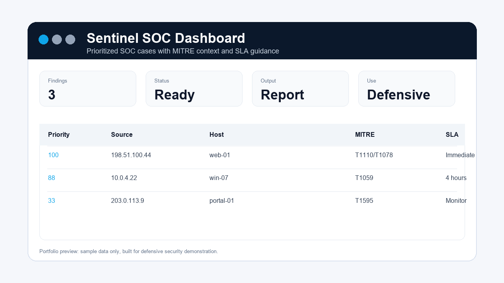

# Sentinel SOC Dashboard


[](https://github.com/Khanu123/sentinel-soc-dashboard/actions/workflows/tests.yml)




Sentinel SOC Dashboard is a defensive security project that turns raw alert data into prioritized analyst cases. It is designed to show practical SOC thinking: grouping related alerts, mapping MITRE ATT&CK context, scoring severity, recording analyst notes, handling possible false positives, and exporting reports that a junior analyst could use during triage.

## Why This Project Matters

SOC teams do not need another noisy alert list. They need clear prioritization, evidence, next actions, and a way to explain why a case should be escalated or monitored. This project demonstrates that workflow in a safe synthetic lab.

This is the project I would lead with in interviews because it shows:

- Practical blue-team mindset.
- Python automation beyond basic scripts.
- MITRE ATT&CK awareness.
- Severity and SLA-based triage.
- False-positive review habits.
- Exportable reports for analyst and stakeholder communication.
- Tests and sample data that make the project easy to evaluate.

## Current Capabilities

- Loads safe synthetic SOC alert data from JSON.
- Groups related alerts into cases by source IP and affected host.
- Scores cases using top severity, alert volume, and tactic diversity.
- Maps tactics to MITRE ATT&CK techniques.
- Adds analyst notes and false-positive handling guidance.
- Tracks open and closed alert counts inside each case.
- Extracts simple indicators of compromise from sample alerts.
- Exports HTML, CSV, JSON, and Markdown incident reports.
- Includes unit tests for scoring, MITRE mapping, notes, false-positive handling, and sample data loading.

## Example Analyst Output

```text
Loaded 8 alerts.
Created 5 prioritized cases.
HTML report: docs/examples/soc_report.html
CSV report: docs/examples/soc_cases.csv
JSON report: docs/examples/soc_cases.json
Markdown report: docs/examples/example_soc_report.md
```

Example case fields:

| Field | Purpose |
| --- | --- |
| `priority` | Sorts the analyst queue by urgency |
| `mitre` | Shows ATT&CK context for investigation |
| `sla` | Gives the response expectation |
| `analyst_notes` | Explains what to validate next |
| `false_positive_handling` | Forces a check before over-escalation |
| `recommended_action` | Gives the next triage step |

## Quick Start

```bash
python -m venv .venv
.venv\Scripts\activate
pip install -e .
set PYTHONPATH=src
python -m sentinel_soc_dashboard.cli
python -m unittest discover -s tests -v
```

Use custom output paths:

```bash
python -m sentinel_soc_dashboard.cli ^
  --alerts sample_data/alerts.json ^
  --html docs/examples/soc_report.html ^
  --csv docs/examples/soc_cases.csv ^
  --json docs/examples/soc_cases.json ^
  --markdown docs/examples/example_soc_report.md
```

Use custom scoring:

```bash
python -m sentinel_soc_dashboard.cli --config config.example.json
```

## How It Helps a SOC Analyst

1. A raw stream of alerts is loaded from `sample_data/alerts.json`.
2. Alerts are normalized into consistent Python objects.
3. Related alerts are grouped by source IP and affected host.
4. Each group becomes a case with severity, volume, and MITRE context.
5. The tool adds analyst notes, false-positive checks, SLA guidance, and recommended actions.
6. Reports are exported so the findings can be reviewed, shared, or attached to a case record.

## Sample Data

The sample dataset is synthetic and safe. It includes examples such as:

- SSH brute-force followed by successful login.
- Encoded PowerShell and suspicious network activity.
- Web scanner activity that may be benign.
- Account discovery and possible archive staging.
- Blocked obfuscated script execution.

No real customer data, credentials, exploit code, or live scanning is included.

## Documentation

- [Example HTML Report](docs/examples/soc_report.html)
- [Example Markdown Report](docs/examples/example_soc_report.md)
- [Architecture](docs/architecture.md)
- [Case Study](docs/case-study.md)
- [How I Built a SOC Alert Triage Tool](docs/how-i-built-soc-alert-triage-tool.md)
- [Interview Notes](INTERVIEW_NOTES.md)
- [Roadmap](ROADMAP.md)

## Skills Demonstrated

- Python data processing.
- Defensive security automation.
- SOC alert triage workflow.
- MITRE ATT&CK mapping.
- Risk scoring and SLA logic.
- Security reporting.
- Unit testing.
- GitHub Actions.
- Clear technical documentation.

## Responsible Use

This project is defensive. It analyzes provided alert data and does not perform scanning, exploitation, credential attacks, or intrusive actions. All sample data is synthetic and intended for learning, portfolio review, and interview discussion.
