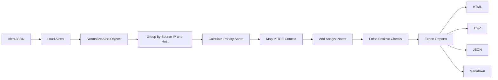

# Architecture



## Components

| Component | Purpose |
| --- | --- |
| `cli.py` | Command-line entry point and report options |
| `core.py` | Parsing, triage, scoring, MITRE mapping, analyst notes, false-positive handling, and report writing |
| `sample_data/alerts.json` | Safe synthetic SOC alert data with IOCs and analyst context |
| `config.example.json` | Adjustable scoring and SLA configuration |
| `docs/examples/` | Generated HTML, CSV, JSON, and Markdown report outputs |
| `tests/` | Unit tests for prioritization, MITRE context, analyst notes, false-positive guidance, and sample data |

## Scoring Model

```text
priority = top severity score + volume score + tactic diversity score
```

The final score is capped at `100`.

This intentionally simple model is explainable in an interview and easy to tune for a team.

## Analyst Workflow

The generated case output includes:

- A priority score for queue ordering.
- MITRE ATT&CK context for investigation framing.
- SLA guidance based on top severity.
- Analyst notes that explain what should be checked next.
- False-positive guidance to avoid unnecessary escalation.
- Exportable reports for review and handover.
