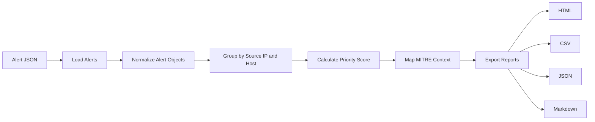

# Architecture



## Components

| Component | Purpose |
| --- | --- |
| `cli.py` | Command-line entry point and report options |
| `core.py` | Parsing, triage, scoring, MITRE mapping, and report writing |
| `sample_data/alerts.json` | Safe demo alert data |
| `config.example.json` | Adjustable scoring and SLA configuration |
| `tests/` | Unit tests for prioritization and reporting context |

## Scoring Model

```text
priority = top severity score + volume score + tactic diversity score
```

The final score is capped at `100`.

This intentionally simple model is explainable in an interview and easy to tune for a team.
